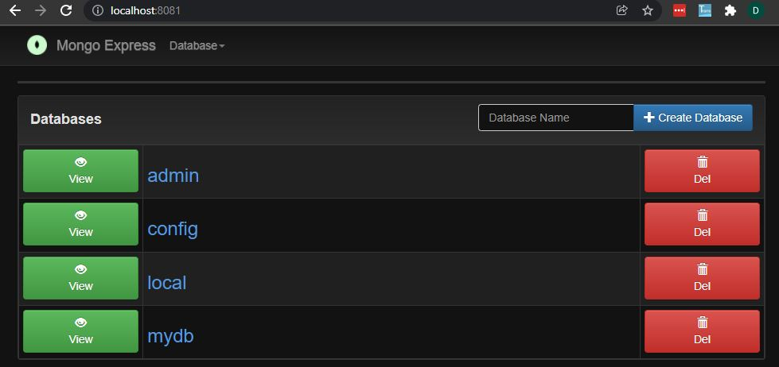

# Mongo Connector CSharp
by Denny Imanuel

This mini project showcase how to connect to Mongo DB using CSharp programming language.
You don't need physical database to test the code. We'll use Docker Compose to create database container.

### Run DB Container

First you need to run Mongo DB container and Mongo Express container using following command:

    docker-compose up

Then you can browse Mongo DB via Mongo Express portal at http://localhost:8081

### Test Connector

Finally you can test connection to Mongo DB via following CSharp connector module:

    MongoConnector.cs

